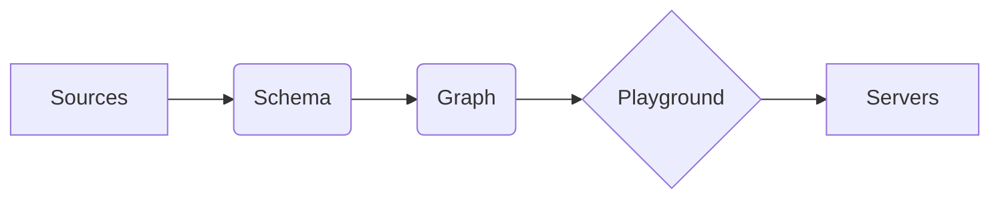

# FIGS: Figs Intelligent Graph Studio
**Build Knowledge Graphs in One Command • Ground LLMs with Graph-Powered RAG**

**(Work in progress)** but welcome stars & contributions!

[](#)
[](#)


<p align="center">
  
</p>


FIG is an open-source toolkit that transforms your unstructured and structured data into **actionable knowledge graphs**, then serves them through a hallucination-resistant chatbot using graph-based Retrieval Augmented Generation (GraphRAG). Designed for developers who want:

✓ **Precision over probability** - Every answer grounded in your explicit knowledge graph  
✓ **Zero ETL graph construction** - Start with tables (CSV/Excel), soon PDFs & databases  
✓ **Cypher-as-a-Service** - Natural language to optimized graph queries via LLM translation

> **⚠️Early Access Alert**  
> This is a proof-of-concept release (pre-alpha). Core features work, but expect rough edges.  
> Current focus: Table → Graph → Chat pipeline • Roadmap includes PDF/Parquet support

## Quick Start (2-Minute Setup)
git clone https://github.com/yourusername/fig.git
cd fig
docker-compose up --build
```

Access the interface at http://localhost:3000. 

### Example Usage
Please refer to the [README doc in data_gen](https://github.com/zhileiz/figs/tree/main/data_gen) for data generation and upload example.

## Core Capabilities 🛠️



### 📊 **Graph Studio**: _Visualize • Edit • Refine_  
- **Live Graph Visualization**: Explore nodes/relationships in an interactive canvas  
- **Precise Graph Editing**: Directly modify node properties, relationship weights, and metadata

### 🧠 **Schema Designer**: _Ontology Engineering Meets LLMs_  
- **Drag-and-Drop Ontology Builder**: Create node/relationship types using visual workflows  
- **AI-Assisted Schema Refinement**: Chat with embedded LLM ("Should 'Customer' inherit from 'Organization'?")  

### 📥 **Data Sources Hub**:  _Controlled Ingestion Pipeline_  
- **Multi-Source Support**: Allow structured, unstructure, static, and live data sources to be ingested into the graph.
- **Precise Editing**: Modify imported nodes/relationships in spreadsheet-like interfaces  
- **Source Tracking**: Audit which source contributed each graph element.

### 🤖 **Cypher Playground**  
- **System Prompt Crafting**: Guide LLM's Cypher generation ("Prioritize shortest-path queries") with a system prompt.
- **Test before release**: Side-by-side natural language ↔ generated Cypher comparison, execution time metrics, result previews before deploying as OpenAI compatible API.

### 🌐 **Deployment Servers**  
- **OpenAI-Compatible API**: Drop-in replacement for existing chatbot applications(\`/v1/chat/completions\`)  
- **Raw Graph Connections**: Bolt protocol support for Neo4j/Tigris direct access (WIP)
- **MCP Server**: Integrate with your own agent through Model Context Protocol. (WIP)  


## Roadmap: What's Cooking? 🔥
Data Source Ingestion:
- [ ]  PDF Support: Extract structured entity & relationshipdata from PDFs.
- [ ]  Database Integration: Connect directly to existing databases.
- [ ]  Parquet Files: Handle large datasets efficiently.

Server Deployment:
- [ ]  Raw Graph DB Connections: Access your graph without intermediaries.
- [ ]  MCP Server: Add Model Context Protocol for better integration with agent ecosystems.

General Features:
- [ ]  Model Selection for agents: Use your preferred LLM (Ollama, Gemini, Claude, Groq, etc.) for agents
- [ ]  Import and export graph as RDF / OWL / JSON.


## Contributing

We welcome contributions and feedback from the community! If you have ideas for improvements, bug fixes, or new features, please feel free to:
 - Open an issue
 - Fork the repository.
 - Create a new branch for your feature or bug fix.
 - Submit a pull request with a detailed description of your changes.